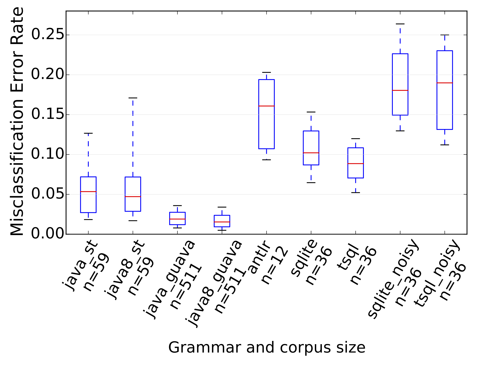
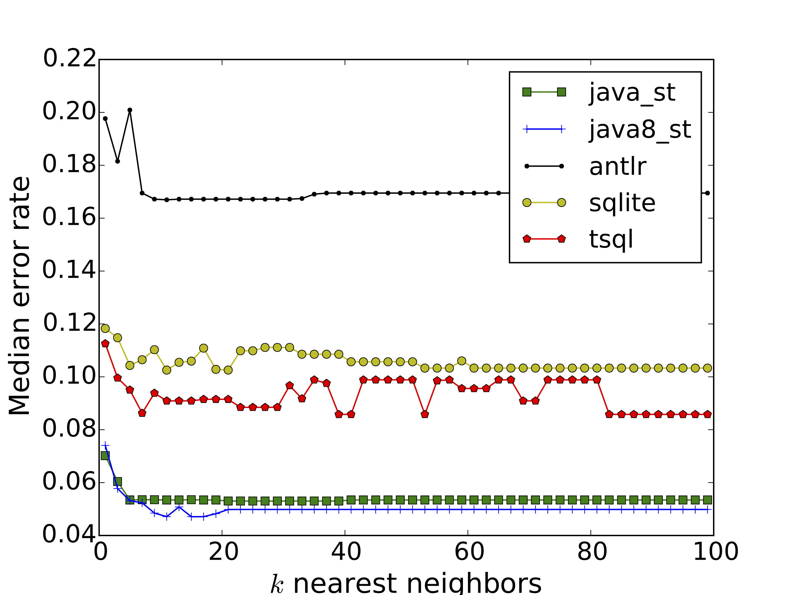

# CodeBuff smart formatter

By Terence Parr (primary developer), Fangzhou (Morgan) Zhang (help with initial development), Jurgen Vinju (co-author of academic paper, help with empirical results and algorithm discussions).

[kaby76](https://github.com/kaby76) has done a [C# port](https://github.com/kaby76/cs-codebuff).

## Abstract

Code formatting is not particularly exciting but many researchers would consider it either unsolved or not well-solved.  The two well-established solutions are:

1.  Build a custom program that formats code for specific a language with ad hoc techniques, typically subject to parameters such as "*always put a space between operators*".
2.  Define a set of formal rules that map input patterns to layout instructions such as "*line these expressions up vertically*".

Either techniques are painful and finicky.  

This repository is a step towards what we hope will be a universal code formatter that uses machine learning to look for patterns in a corpus and to format code using those patterns.  

It requires Java 8. See `pom.xml` for dependencies (e.g., ANTLR 4.x, ...).

*Whoa!* It appears to work.  Academic paper, [Towards a Universal Code Formatter through Machine Learning](http://arxiv.org/abs/1606.08866) accepted to SLE2016.  Sample output is in the paper or next section. Video from [Terence's presentation](https://www.youtube.com/watch?v=Mni2HVGGUdo).

## Sample output

All input is completed squeezed of whitespace/newlines so only the output really matters when examining CodeBuff output. You can check out the [output](https://github.com/antlr/codebuff/tree/master/output) dir for leave-one-out formatting of the various [corpora](https://github.com/antlr/codebuff/tree/master/corpus). But, here are some sample formatting results.

### SQL

```sql
SELECT *
FROM DMartLogging
WHERE DATEPART(day, ErrorDateTime) = DATEPART(day, GetDate())
      AND DATEPART(month, ErrorDateTime) = DATEPART(month, GetDate())
      AND DATEPART(year, ErrorDateTime) = DATEPART(year, GetDate())
ORDER BY ErrorDateTime
    DESC
```

```sql
SELECT
    CASE WHEN SSISInstanceID IS NULL
        THEN 'Total'
    ELSE SSISInstanceID END SSISInstanceID
    , SUM(OldStatus4) AS OldStatus4
    , SUM(Status0) AS Status0
    , SUM(Status1) AS Status1
    , SUM(Status2) AS Status2
    , SUM(Status3) AS Status3
    , SUM(Status4) AS Status4
    , SUM(OldStatus4 + Status0 + Status1 + Status2 + Status3 + Status4) AS InstanceTotal
FROM
    (
        SELECT
            CONVERT(VARCHAR, SSISInstanceID)             AS SSISInstanceID
            , COUNT(CASE WHEN Status = 4 AND
                              CONVERT(DATE, LoadReportDBEndDate) <
                              CONVERT(DATE, GETDATE())
                        THEN Status
                    ELSE NULL END)             AS OldStatus4
            , COUNT(CASE WHEN Status = 0
                        THEN Status
                    ELSE NULL END)             AS Status0
            , COUNT(CASE WHEN Status = 1
                        THEN Status
                    ELSE NULL END)             AS Status1
            , COUNT(CASE WHEN Status = 2
                        THEN Status
                    ELSE NULL END)             AS Status2
            , COUNT(CASE WHEN Status = 3
                        THEN Status
                    ELSE NULL END)             AS Status3
--, COUNT ( CASE WHEN Status = 4 THEN Status ELSE NULL END ) AS Status4
            , COUNT(CASE WHEN Status = 4 AND
                              DATEPART(DAY, LoadReportDBEndDate) = DATEPART(DAY, GETDATE())
                        THEN Status
                    ELSE NULL END)             AS Status4
        FROM dbo.ClientConnection
        GROUP BY SSISInstanceID
    ) AS StatusMatrix
GROUP BY SSISInstanceID
```

### Java

```java
public class Interpreter {
    ...
    public static final Set<String> predefinedAnonSubtemplateAttributes = new HashSet<String>() {
                                                                              {
                                                                                  add("i");
                                                                                  add("i0");
                                                                              }
                                                                          };
...
    public int exec(STWriter out, InstanceScope scope) {
        final ST self = scope.st;
        if ( trace ) System.out.println("exec("+self.getName()+")");
        try {
            setDefaultArguments(out, scope);
            return _exec(out, scope);
        }
        catch (Exception e) {
            StringWriter sw = new StringWriter();
            PrintWriter pw = new PrintWriter(sw);
            e.printStackTrace(pw);
            pw.flush();
            errMgr.runTimeError(this,
                                scope,
                                ErrorType.INTERNAL_ERROR,
                                "internal error: "+sw.toString());
            return 0;
        }
    }
...
    protected int _exec(STWriter out, InstanceScope scope) {
        final ST self = scope.st;
        int start = out.index(); // track char we're about to write
        int prevOpcode = 0;
        int n = 0; // how many char we write out
        int nargs;
        int nameIndex;
        int addr;
        String name;
        Object o, left, right;
        ST st;
        Object[] options;
        byte[] code = self.impl.instrs;        // which code block are we executing
        int ip = 0;
        while ( ip<self.impl.codeSize ) {
            if ( trace|| debug ) trace(scope, ip);
            short opcode = code[ip];
            //count[opcode]++;
            scope.ip = ip;
            ip++; //jump to next instruction or first byte of operand
            switch ( opcode ) {
                case Bytecode.INSTR_LOAD_STR:
                    // just testing...
                    load_str(self, ip);
                    ip += Bytecode.OPND_SIZE_IN_BYTES;
                    break;
                case Bytecode.INSTR_LOAD_ATTR:
                    nameIndex = getShort(code, ip);
                    ip += Bytecode.OPND_SIZE_IN_BYTES;
                    name = self.impl.strings[nameIndex];
                    try {
                        o = getAttribute(scope, name);
                        if ( o== ST.EMPTY_ATTR ) o = null;
                        }
                    catch (STNoSuchAttributeException nsae) {
                        errMgr.runTimeError(this, scope, ErrorType.NO_SUCH_ATTRIBUTE, name);
                        o = null;
                    }
                    operands[++sp] = o;
                    break;
...
```

### ANTLR

```
referenceType : classOrInterfaceType | typeVariable | arrayType ;

classOrInterfaceType
    :   (   classType_lfno_classOrInterfaceType
        |   interfaceType_lfno_classOrInterfaceType
        )
        (   classType_lf_classOrInterfaceType
        |   interfaceType_lf_classOrInterfaceType
        )*
    ;
```

```
classModifier
    :   annotation
    |   'public'
    |   'protected'
    |   'private'
    |   'abstract'
    |   'static'
    |   'final'
    |   'strictfp'
    ;
```

```
typeSpecifier
    :   (   'void'
        |   'char'
        |   'short'
        |   'int'
        |   'long'
        |   'float'
        |   'double'
        |   'signed'
        |   'unsigned'
        |   '_Bool'
        |   '_Complex'
        |   '__m128'
        |   '__m128d'
        |   '__m128i'
        )
    |   '__extension__' '(' ('__m128' | '__m128d' | '__m128i') ')'
    |   atomicTypeSpecifier
    |   structOrUnionSpecifier
    |   enumSpecifier
    |   typedefName
    |   '__typeof__' '(' constantExpression ')' // GCC extension
    ;
```

## Build complete jar

To make a complete jar with all of the dependencies, do this from the repo main directory:

```bash
$ mvn clean compile install
```

This will leave you with artifact `target/codebuff-1.4.19.jar` or whatever the version number is and put the jar into the usual maven local cache.

## Formatting files

To use the formatter, you need to use class `org.antlr.codebuff.Tool`.  Commandline usage:

* `-g` *grammar-name*. The grammar must be run through ANTLR and be compiled (and in the `CLASSPATH`). For example, for `Java8.g4`, use `-g Java8`, not the filename. For separated grammar files, like `ANTLRv4Parser.g4` and `ANTLRv4Lexer.g4`, use `-g ANTLRv4`. If the grammar is in a package, use fully-qualified like `-g org.antlr.codebuff.ANTLRv4`.
* `-rule` *start-rule*. Start rule of the grammar where parsing of a full file starts, such as `compilationUnit` in `Java.g4`.
* `-corpus` *root-dir-of-samples*
* [`-files` *file-extension]*. E.g., use `java`, `g4`, `c`, ...
* [`-indent` *num-spaces]*.  This defaults to 4 spaces indentation.
* [`-comment` *line-comment-name*]. As a failsafe, CodeBuff allows you to specify the token name for single-line comments, such as `LINE_COMMENT`, within the grammar so that it can ensure there is a line break after a single line,.
* [`-o` *output-file*]. Filename with optional path to where output should go.
* *file-to-format*. Filename (with optional path) must be last.

Output goes to standard out unless you use `-o`.
 
```bash
$ java -jar target/codebuff-1.4.19.jar  \
       -g org.antlr.codebuff.ANTLRv4 \
       -rule grammarSpec \
       -corpus corpus/antlr4/training \
       -files g4 \
       -indent 4 \
       -comment LINE_COMMENT \
       T.g4
```

```bash
$ java -jar target/codebuff-1.4.19.jar \
       -g org.antlr.codebuff.Java \
       -rule compilationUnit \
       -corpus corpus/java/training/stringtemplate4 \
       -files java \
       -comment LINE_COMMENT \
       T.java
```

These examples work for the grammars specified because they are already inside the complete jar. For parsers compiled outside of the jar, you might need to do something like:

```bash
java java -cp target/codebuff-1.4.19.jar:$CLASSPATH \
       org.antlr.codebuff.Tool  \
       -g org.antlr.codebuff.ANTLRv4 \
       -rule grammarSpec -corpus corpus/antlr4/training \
       -files g4 -indent 4 -comment LINE_COMMENT T.g4
```

### Grammar requirements

All whitespace should go to the parser on a hidden channel. For example, here is a rule that does that:

```
WS  :	[ \t\r\n\f]+ -> channel(HIDDEN)	;
```

Comments should also:

```
BLOCK_COMMENT
	:	'/*' .*? ('*/' | EOF)  -> channel(HIDDEN)
	;

LINE_COMMENT
	:	'//' ~[\r\n]*  -> channel(HIDDEN)
	;
```

You can have line comments match newlines if you want.

## Speed tests

The paper cites some speed tests for training and formatting time for

* [guava corpus](https://github.com/antlr/codebuff/tree/master/corpus/java/training/guava) and [java grammar](https://github.com/antlr/codebuff/blob/master/grammars/org/antlr/codebuff/Java.g4)
* [guava corpus](https://github.com/antlr/codebuff/tree/master/corpus/java/training/guava) and [java8 grammar](https://github.com/antlr/codebuff/blob/master/grammars/org/antlr/codebuff/Java8.g4)
* [antlr corpus](https://github.com/antlr/codebuff/tree/master/corpus/antlr4/training) and [antlr parser grammar](https://github.com/antlr/codebuff/blob/master/grammars/org/antlr/codebuff/ANTLRv4Parser.g4), [antlr lexer grammar](https://github.com/antlr/codebuff/blob/master/grammars/org/antlr/codebuff/ANTLRv4Lexer.g4)

First, here is my machine configuration:


Memory speed seems to make a big difference given how much we have to trawl through memory---The tests shown below were done with 1867 MHz DDR3 RAM.  We set an initial 4G RAM, 1M stack size.  First build everything:

```bash
$ mvn clean compile install
```

Then you can run the speed tests as shown in following subsections.

#### ANTLR corpus

```bash
$ java -Xmx4G -Xss1M -cp target/codebuff-1.4.19.jar org.antlr.codebuff.validation.Speed -antlr corpus/antlr4/training/Java8.g4
Loaded 12 files in 172ms
antlr training of /Users/parrt/antlr/code/codebuff/corpus/antlr4/training/Java8.g4 = 353ms formatting = 340ms
antlr training of /Users/parrt/antlr/code/codebuff/corpus/antlr4/training/Java8.g4 = 188ms formatting = 161ms
antlr training of /Users/parrt/antlr/code/codebuff/corpus/antlr4/training/Java8.g4 = 145ms formatting = 153ms
antlr training of /Users/parrt/antlr/code/codebuff/corpus/antlr4/training/Java8.g4 = 130ms formatting = 129ms
antlr training of /Users/parrt/antlr/code/codebuff/corpus/antlr4/training/Java8.g4 = 123ms formatting = 113ms
antlr training of /Users/parrt/antlr/code/codebuff/corpus/antlr4/training/Java8.g4 = 114ms formatting = 116ms
antlr training of /Users/parrt/antlr/code/codebuff/corpus/antlr4/training/Java8.g4 = 93ms formatting = 90ms
antlr training of /Users/parrt/antlr/code/codebuff/corpus/antlr4/training/Java8.g4 = 80ms formatting = 90ms
antlr training of /Users/parrt/antlr/code/codebuff/corpus/antlr4/training/Java8.g4 = 73ms formatting = 88ms
antlr training of /Users/parrt/antlr/code/codebuff/corpus/antlr4/training/Java8.g4 = 72ms formatting = 71ms
antlr training of /Users/parrt/antlr/code/codebuff/corpus/antlr4/training/Java8.g4 = 71ms formatting = 69ms
antlr training of /Users/parrt/antlr/code/codebuff/corpus/antlr4/training/Java8.g4 = 71ms formatting = 73ms
antlr training of /Users/parrt/antlr/code/codebuff/corpus/antlr4/training/Java8.g4 = 76ms formatting = 63ms
antlr training of /Users/parrt/antlr/code/codebuff/corpus/antlr4/training/Java8.g4 = 70ms formatting = 70ms
antlr training of /Users/parrt/antlr/code/codebuff/corpus/antlr4/training/Java8.g4 = 70ms formatting = 69ms
antlr training of /Users/parrt/antlr/code/codebuff/corpus/antlr4/training/Java8.g4 = 73ms formatting = 70ms
antlr training of /Users/parrt/antlr/code/codebuff/corpus/antlr4/training/Java8.g4 = 70ms formatting = 68ms
antlr training of /Users/parrt/antlr/code/codebuff/corpus/antlr4/training/Java8.g4 = 71ms formatting = 66ms
antlr training of /Users/parrt/antlr/code/codebuff/corpus/antlr4/training/Java8.g4 = 70ms formatting = 70ms
antlr training of /Users/parrt/antlr/code/codebuff/corpus/antlr4/training/Java8.g4 = 73ms formatting = 72ms
median of [5:19] training 72ms
median of [5:19] formatting 70ms
```

#### Guava corpus, Java grammar

```bash
$ java -Xms4G -Xss1M -cp target/codebuff-1.4.19.jar org.antlr.codebuff.validation.Speed -java_guava corpus/java/training/guava/cache/LocalCache.java
Loaded 511 files in 1949ms
java_guava training of /Users/parrt/antlr/code/codebuff/corpus/java/training/guava/cache/LocalCache.java = 1984ms formatting = 2669ms
java_guava training of /Users/parrt/antlr/code/codebuff/corpus/java/training/guava/cache/LocalCache.java = 1747ms formatting = 3166ms
java_guava training of /Users/parrt/antlr/code/codebuff/corpus/java/training/guava/cache/LocalCache.java = 1784ms formatting = 2811ms
java_guava training of /Users/parrt/antlr/code/codebuff/corpus/java/training/guava/cache/LocalCache.java = 1507ms formatting = 1742ms
java_guava training of /Users/parrt/antlr/code/codebuff/corpus/java/training/guava/cache/LocalCache.java = 1499ms formatting = 2832ms
java_guava training of /Users/parrt/antlr/code/codebuff/corpus/java/training/guava/cache/LocalCache.java = 1582ms formatting = 2663ms
java_guava training of /Users/parrt/antlr/code/codebuff/corpus/java/training/guava/cache/LocalCache.java = 1499ms formatting = 2807ms
java_guava training of /Users/parrt/antlr/code/codebuff/corpus/java/training/guava/cache/LocalCache.java = 1561ms formatting = 2815ms
java_guava training of /Users/parrt/antlr/code/codebuff/corpus/java/training/guava/cache/LocalCache.java = 1521ms formatting = 2136ms
java_guava training of /Users/parrt/antlr/code/codebuff/corpus/java/training/guava/cache/LocalCache.java = 1545ms formatting = 2811ms
java_guava training of /Users/parrt/antlr/code/codebuff/corpus/java/training/guava/cache/LocalCache.java = 1501ms formatting = 2800ms
java_guava training of /Users/parrt/antlr/code/codebuff/corpus/java/training/guava/cache/LocalCache.java = 1506ms formatting = 2581ms
java_guava training of /Users/parrt/antlr/code/codebuff/corpus/java/training/guava/cache/LocalCache.java = 1494ms formatting = 2838ms
java_guava training of /Users/parrt/antlr/code/codebuff/corpus/java/training/guava/cache/LocalCache.java = 1494ms formatting = 2789ms
java_guava training of /Users/parrt/antlr/code/codebuff/corpus/java/training/guava/cache/LocalCache.java = 1497ms formatting = 2621ms
java_guava training of /Users/parrt/antlr/code/codebuff/corpus/java/training/guava/cache/LocalCache.java = 1501ms formatting = 2714ms
java_guava training of /Users/parrt/antlr/code/codebuff/corpus/java/training/guava/cache/LocalCache.java = 1506ms formatting = 2816ms
java_guava training of /Users/parrt/antlr/code/codebuff/corpus/java/training/guava/cache/LocalCache.java = 1512ms formatting = 2733ms
java_guava training of /Users/parrt/antlr/code/codebuff/corpus/java/training/guava/cache/LocalCache.java = 1515ms formatting = 2587ms
java_guava training of /Users/parrt/antlr/code/codebuff/corpus/java/training/guava/cache/LocalCache.java = 1508ms formatting = 2430ms
median of [5:19] training 1506ms
median of [5:19] formatting 2733ms
```

#### Guava corpus, Java8 grammar

Load time here is very slow (2.5min) because the Java8 grammar is meant to reflect the language spec. It has not been optimized for performance. Once the corpus is loaded, training and formatting times are about the same as for Java grammar.

```bash
$ java -Xms4G -Xss1M -cp target/codebuff-1.4.19.jar \
       org.antlr.codebuff.validation.Speed \
       -java8_guava corpus/java/training/guava/cache/LocalCache.java
Loaded 511 files in 159947ms
java8_guava training of /Users/parrt/antlr/code/codebuff/corpus/java/training/guava/cache/LocalCache.java = 2238ms formatting = 23312ms
java8_guava training of /Users/parrt/antlr/code/codebuff/corpus/java/training/guava/cache/LocalCache.java = 1913ms formatting = 2368ms
java8_guava training of /Users/parrt/antlr/code/codebuff/corpus/java/training/guava/cache/LocalCache.java = 1855ms formatting = 2277ms
java8_guava training of /Users/parrt/antlr/code/codebuff/corpus/java/training/guava/cache/LocalCache.java = 1856ms formatting = 2267ms
java8_guava training of /Users/parrt/antlr/code/codebuff/corpus/java/training/guava/cache/LocalCache.java = 1868ms formatting = 2348ms
java8_guava training of /Users/parrt/antlr/code/codebuff/corpus/java/training/guava/cache/LocalCache.java = 1890ms formatting = 2263ms
java8_guava training of /Users/parrt/antlr/code/codebuff/corpus/java/training/guava/cache/LocalCache.java = 1866ms formatting = 2328ms
java8_guava training of /Users/parrt/antlr/code/codebuff/corpus/java/training/guava/cache/LocalCache.java = 1855ms formatting = 2247ms
java8_guava training of /Users/parrt/antlr/code/codebuff/corpus/java/training/guava/cache/LocalCache.java = 1856ms formatting = 2243ms
java8_guava training of /Users/parrt/antlr/code/codebuff/corpus/java/training/guava/cache/LocalCache.java = 1871ms formatting = 2204ms
java8_guava training of /Users/parrt/antlr/code/codebuff/corpus/java/training/guava/cache/LocalCache.java = 1863ms formatting = 2244ms
java8_guava training of /Users/parrt/antlr/code/codebuff/corpus/java/training/guava/cache/LocalCache.java = 1850ms formatting = 2212ms
java8_guava training of /Users/parrt/antlr/code/codebuff/corpus/java/training/guava/cache/LocalCache.java = 1861ms formatting = 2215ms
java8_guava training of /Users/parrt/antlr/code/codebuff/corpus/java/training/guava/cache/LocalCache.java = 1877ms formatting = 2257ms
java8_guava training of /Users/parrt/antlr/code/codebuff/corpus/java/training/guava/cache/LocalCache.java = 1843ms formatting = 2249ms
java8_guava training of /Users/parrt/antlr/code/codebuff/corpus/java/training/guava/cache/LocalCache.java = 1842ms formatting = 2205ms
java8_guava training of /Users/parrt/antlr/code/codebuff/corpus/java/training/guava/cache/LocalCache.java = 1869ms formatting = 2343ms
java8_guava training of /Users/parrt/antlr/code/codebuff/corpus/java/training/guava/cache/LocalCache.java = 1864ms formatting = 2225ms
java8_guava training of /Users/parrt/antlr/code/codebuff/corpus/java/training/guava/cache/LocalCache.java = 1851ms formatting = 2260ms
java8_guava training of /Users/parrt/antlr/code/codebuff/corpus/java/training/guava/cache/LocalCache.java = 1871ms formatting = 2200ms
median of [5:19] training 1863ms
median of [5:19] formatting 2244ms
```

## Generating graphs from paper

In the *Towards a Universal Code Formatter Through Machine Learning* paper, we have three graphs to support our conclusions. This sections shows how to reproduce them. (Note that these jobs take many minutes to run; maybe up to 30 minutes for one of them on a fast box.)

The Java code generates python code that uses matplotlib. The result of running the python is a PDF of the graph (that also pops up in a window).

### Box plot with median error rates

To generate:



do this:

```bash
$ mvn clean compile install
$ java -Xms8G -Xss1M -cp target/codebuff-1.4.19.jar org.antlr.codebuff.validation.LeaveOneOutValidator
...
wrote python code to python/src/leave_one_out.py
$ cd python/src
$ python leave_one_out.py &
```

### Plot showing effect of corpus size on error rate

To generate:


do this:

```bash
$ mvn clean compile install
$ java -Xms8G -Xss1M -cp target/codebuff-1.4.19.jar org.antlr.codebuff.validation.SubsetValidator
...
wrote python code to python/src/subset_validator.py
$ cd python/src
$ python subset_validator.py &
```

### Plot showing effect of varying model parameter k

To generate:



do this:

```bash
$ mvn clean compile install
$ java -Xms8G -Xss1M -cp target/codebuff-1.4.19.jar org.antlr.codebuff.validation.TestK
...
wrote python code to python/src/vary_k.py
$ cd python/src
$ python vary_k.py &
```
