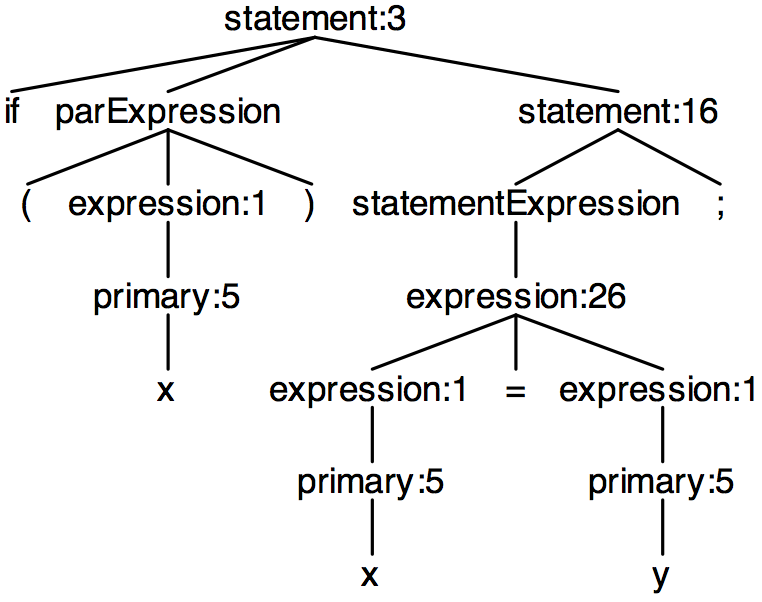

# CodeBuff Second implementation

*Document in progress*

The first version looked at a window of tokens and rule context information to predict: injecting newlines, injecting whitespace, alignment, and indentation. It works surprisingly well but it makes no guarantees that things will line up properly. For example we had to add a new feature so that {...} had both curlies on the same line if the statements in the block were on the same line.

The new approach is to look at subtree structures and identify the most common patterns. The idea is to figure out what whitespace, if any, to inject in between siblings of a parse subtree. As we walk down the tree, we have `currentColumn` information. We process each subtree after processing all of its children, so that we have information about whether lists got broken across lines etc.

## Token dependencies

Here is a simple java method definition:

```java
void f(int i, int j) {
}
```

and associated parse tree:
 


The parentheses around the parameter list are codependent and the decisions to inject white space after the `(` and before the `)` often depend on whether the `formalParameterList` child gets split across multiple lines. In this case, the parameters are all on a single line so we might train:

| Features      | Prediction |
| ------------- |:-------------:|
| (root=formalParameters,`(`, formalParameterList, formalParameterList-same-line) | none |
| (root=formalParameters, formalParameterList, formalParameterList-same-line, `)`) | none |

If we decide to split the parameters across lines, it would not force white space before and after the parentheses; e.g.,

```java
void f(int i,
       int j) {
}
```

But, we might see examples like this:

```java
void f(
	int i,
	int j
) {
}
```

| Features      | Prediction |
| ------------- |:-------------:|
| (root=formalParameters,`(`, formalParameterList, formalParameterList-split-lines) | inject \n, indent |
| (root=formalParameters, formalParameterList, formalParameterList-split-lines, `)`) | inject \n, no indent |

When processing the `formalParameterList` child, we only decided to align but did not make the decision to indent. That is the decision for `formalParameters`.  We treat the output of `formalParameterList` almost like a big character.

This implies that `formalParameterList` does not know a precise starting column. We would feed it the column of the `(` for it to make a decision, but then we might indent it. That implies that we don't get a string back but rather an `V` (BOX terminology for vertical alignment) operator on that child.

old stuff:

Here is an example where we want the `}` to line up with the `void`, but those tokens are in a subtree. On the other hand, we can always ask whether or not the last token for a subtree, `}` here, aligns with another token.


| Features      | Prediction |
| ------------- |:-------------:|
|(methodDeclaration, void, ID) | none (same line)|
|(methodDeclaration, void, }) | align tokens|
|(methodDeclaration, ID, }) | none (diff line)|

We could start with that modest goal. It would work for ANTLR too.

```
a : x
  | y
  ;
```


| Features      | Prediction |
| ------------- |:-------------:|
|(parserRuleSpec, ID, :) | none (same line)|
|(parserRuleSpec, ID, ;) | none (diff line)|
|(parserRuleSpec, :, ;) | align tokens|

If everything were on one line, then there would be no alignment trained (or predicted, hopefully):

```
a : x | y ;
```

There could be multiple alignments. For example, with SQL, we might see three tokens aligned:

```sql
SELECT
	NAME, ID
FROM
	USERS
;
```

| Features      | Prediction |
| ------------- |:-------------:|
|(selectStmt, SELECT, FROM) | align tokens|
|(selectStmt, SELECT, ;) | align tokens|
|(selectStmt, FROM, ;) | align tokens|

## Lists of elements

We not only have to line up certain tokens, but lists of elements are often aligned. Lists can be defined in two ways:

* Direct siblings with the same rule name
* First token of direct siblings are aligned (`switch` subtrees are `statement`s with `switchBlockStatementGroup` for cases and `switchLabel` for `default` so they have different names but first tokens are aligned)

Formatting lists has a few key patterns:

* Are the elements aligned or not (first token of each element)
* If aligned, are the elements first on line or is the separator first? This dictates whether or not the newline gets injected before or after the separator.
* Is the first element on a line by itself? If so, indented?

For Java, such as:

```java
{
	int i;
	x=y;
}
```


We get:

| Features      | Prediction |
| ------------- |:-------------:|
| (block,blockStatement) | aligned, \n before first el, indent first el, no sep |
| | |
| (block,{,}) | align tokens |

For the antlr example again, we have a problem:

```
a : x
  | y		// the '|' is indented let's say; not aligned
  ;
```

Let's assume we can only align the elements, not the separators, and can only align on first tokens of a line. If not aligned, we can still indent. So, we get

| Features      | Prediction |
| ------------- |:-------------:|
|(ruleAltList, labeledAlt) | unaligned, no \n before first el, \n before sep, indent following|

Here, `indent following` means that each element is indented, except for perhaps the first one if it has no newline before it.

I've seen people make rules like the following:

```
biggy :
	x |
	y |
	z
	;
```

we get

| Features      | Prediction |
| ------------- |:-------------:|
|(ruleAltList, labeledAlt) | aligned, \n before first el, indent first el, \n after sep|

Looking at the formal method arg list above but with new formatting:

```java
void f(int i,
       int j) 
{
}
```

we get

| Features      | Prediction |
| ------------- |:-------------:|
|(formalParameterList,formalParameter) | aligned, no \n before first el, \n after sep|

```java
void f(
	int i,
	int j) 
{
}
```

we get

| Features      | Prediction |
| ------------- |:-------------:|
|(formalParameterList,formalParameter) | aligned, \n before first el, indent first el, \n after sep|

*If things are not aligned then we assume they all go on the same line.*

## Indent

Instead of keeping a current indent level and then having to worry about how much to dedent at the end of a list, it's probably better to think about this in a functional way. We inject newlines and indentation but that is all relative to the ancestors of the current tree. It could be that the current code block subtree is nested deeply within some function. All we care about is whether or not we indent the current block's first element.  We don't have to undo some `currentIndent` state variable to the indent level of the immediate ancestor.

For example, in a Java switch statement, the dedent is like 3x on a `default` clause without statements:
 
```java
switch ( x ) {
	case 0 :
		break;
	case 1 :
		break;
	default :
}
```


| Features      | Prediction |
| ------------- |:-------------:|
| (statement,switchBlockStatementGroup/switchLabel) | aligned, \n before first el, no separator, indented |
| | |
| (statement,switch,{) | none (same line) |
| (statement,switch,}) | align tokens |
| (statement,{,}) | none (diff line)|

How do we know to indent `break;` in the switch? It's a special case of a list, that has one element.  Because we are analyzing the entire tree, we will no doubt recognize that `switchBlockStatementGroup` has a list of `blockStatement` but that requires that the corpus be much more exhaustive. Probably better to handle two children that are offset from each other. 

It's the same problem as an IF which can only have one statement:

```java
if ( x )
	x=y;
```



Just as we record token dependencies, we could introduce the notion of indent between any two *adjacent* siblings. We would do this for siblings not considered part of a list.

| Features      | Prediction |
| ------------- |:-------------:|
|(root statement, `if`, sibling parExpression)| none (same line) |
|(root statement, parExpression, statement)| inject \n and indent |

For `if ( x ) x=y;` on one line, we'd train all possible indents as as `none (same line)`.

## Whitespace between tokens

Use current rule, two previous, current, and next token as context to train / predict whitespace between two tokens.  Seems like we'd do this phase as a last step on any subtree before finishing that subtree off. First do the alignment/indentation to figure out where to inject newlines and whitespace.  Result of finishing a subtree should be a properly formatted bit of output.

## Output sensitive to the column

A problem with computing everything from a bottom-up point of view is that we don't know how wide something is going to be until we finish walking the tree. So it would seem we need two passes. The first pass computes where and what to inject without concern for any line width. The second path down the tree would carry along the column information. Hmm.. We need to change our answers to the first pass based upon this column information.

## Implementation details

### Visitor return values

Let's assume for the moment that we use a simple visitor to walk the tree, computing the formatted output. What exactly is the return value (and type) from the visitor methods?  The alternative is to perhaps modify the token stream or annotate the parse tree.

### Thinking inside the BOX

Maybe we ought to simply generate [BOX](http://oai.cwi.nl/oai/asset/4328/04328D.pdf)-like stuff or [GPP box-like pretty printer](http://oai.cwi.nl/oai/asset/4328/04328D.pdf). I don't see a lot of complete examples readily available from a web search. Examples I see are fairly hard to read.

Each parse tree node would be wrapped in a node "operator" that indicated how the subtree should be formatted. It would be like creating a shadow tree. A composition of boxes.

BOX has two operators we would need:

* `H` horizontal (with number of spaces)
* `V` vertical (with optional indent)

And maybe an `I` identity operator around leaf nodes for composition purposes.

GPP also has `ALT` to choose between different layouts depending on how much space is available. In our case, we would instead be training a model to pick which format to use.

Let's revisit some of the previous examples

```java
if ( x )
	x=y;
```


In BOX, we might do something like:

```
V indent=4 [H["if" "(" x ")"] H["x" "=" "y" ";"]]
```

Maybe that is easier than wrapping the parse tree with operators.

### Canonical operations

Actually, maybe it's easier the way I've been thinking: injecting whitespace between siblings. It's easier to train the model to notice relationships between siblings etc.. So what are the canonical operations then?

* Inject \n with or without indent
* Inject \n with or without alignment to another sibling
* Align subset of siblings with options:
	* first element on newline
	* first element on newline and indent
	* if separator found, inject \n before or after

Hmm...align is same as consistent indentation kinda.

How do we guarantee that we don't get this?

```java
int f() { return 3;
}
```


Training from `{ return 3;}` would predict no \n injection I guess and so it'd stay all together on a line.  Training on

```java
{
	return 3;
}
```

would predict injection of \n between siblings `{` and `blockStatement` and would align the curlies:

| Features      | Prediction |
| ------------- |:-------------:|
|(root root statement, {, blockStatement)| inject \n and indent |
| | |
|(block, {, }) | align |
